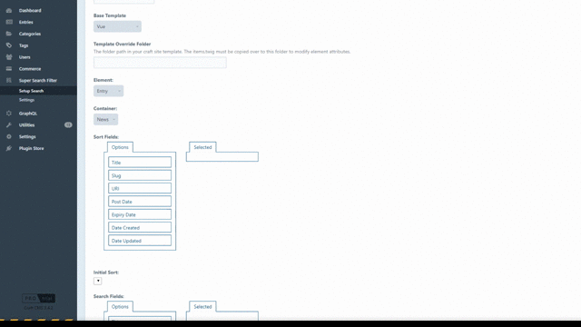
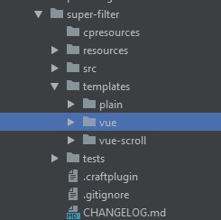

# Super Filter plugin for Craft CMS 3.x  
  
Build your search page with search filters from your element fields and filter element entries by categories, tags, element relations and other fields. 
Easily setup your search page by using twig variable functions, back-end coding not needed.
Supports Vue.js with pre-built styles. 
  
  
  
## Requirements  
  
This plugin requires Craft CMS 3.2.0 or later.  
  
## Installation  
  
To install the plugin, follow these instructions.  
  
 1. Open your terminal and go to your Craft project:  
  
        cd /path/to/project  
  
 2. Then tell Composer to load the plugin:  
  
        composer require pdaleramirez/super-filter  
  
 3. In the Control Panel, go to Settings -> Plugins and click the “Install” button for Search Filter.  
 4. Go to Super Filter -> Setting and click **Install Example Data** button  to generate example entries (Optional).
  
## Configuring Search Filter  
1. Create new setup entry in Setup Search tab and click new setup
2. Setup Config:
- Title - to easily identify your setup.
- Handle - needed to initialize search setup.
- Items per page - number of entries on page content load or pagination.
- Element - the element type of the items or entries to be displayed.
- Container - section, group or product type for an element.
- Sort Fields - drag fields to selected column to be displayed on sorting template for sorting elements.
- Initial Sort - the default sort query on page load.
- Search Fields - drag fields to selected column to be displayed on search field template for filtering elements.
- Template Folder - the folder of the templates that you'll modify to get element attributes or modify html's.

  
## Using Super Filter  
  
1. Open the super-filer plugin folder and choose a folder (vue, vue-scroll and plain) in `templates` to copy to your 
Craft site templates folder.
   

2. Edit your Search Setup entry and input the path of the newly copied folder on the Template Folder input.
3. Use super filter twig function to display search sections on your page. There are 5 twig function to be called
on your page template.
- `craft.superFilter.setup('handle')` - requires 1 parameter which is the handle of search set up entry. This should be 
the first function to be added to the template or the order of declaration should be above all other super filter twig function.
- `craft.superFilter.displaySearchFields()` - displays the search filter fields html.
- `craft.superFilter.displaySortOptions()` - displays the sorting field dropdown html.
- `craft.superFilter.items()` - displays the element entries or filtered element entries.
- `craft.superFilter.getPaginateLinks()` - displays element entries pagination or the infinite scroll trigger.

To modify the html of the twig function. You can edit twig templates you copied on step 2. 

If you choose a template style that has Vue.js make sure to wrap it with a div id of **search-app**

The page template should look like this:
```
<div id="search-app">
    {{ craft.superFilter.setup('searchList') }}
    <div class="row">
        <div class="col-sm-2 col-md-2">
            {{ craft.superFilter.displaySearchFields() }}
        </div>
        <div class="col-sm-10 col-md-10">
            {{ craft.superFilter.displaySortOptions() }}
            {{ craft.superFilter.items() }}
            {{ craft.superFilter.getPaginateLinks() }}
        </div>
    </div>
</div>
```

Brought to you by [Dale Ramirez](https://github.com/pdaleramirez)
